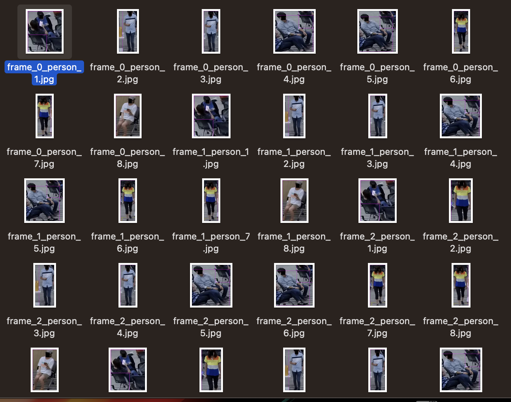

# Aeye
CCTV 인물 자동 탐지 어플리케이션


## Getting started

1. yolo_on_video.py
 - 동영사 내 등장인물에 대하여 yolo르 이용해서 detection을 진행 
 - detection 결과들을 crop해서 persons 디렉토리에 데이터 저장
 - you need yolov3.cfg , yolov3.weights , coco.names in your directory


```bash
# Tensorflow CPU
python yolo_on_video.py --video=1554.mp4 --frame_rate=30
```
- --video="your target video name"
- --frame_rate=number of frame users want to cut 


#### yolo_on_video Result



